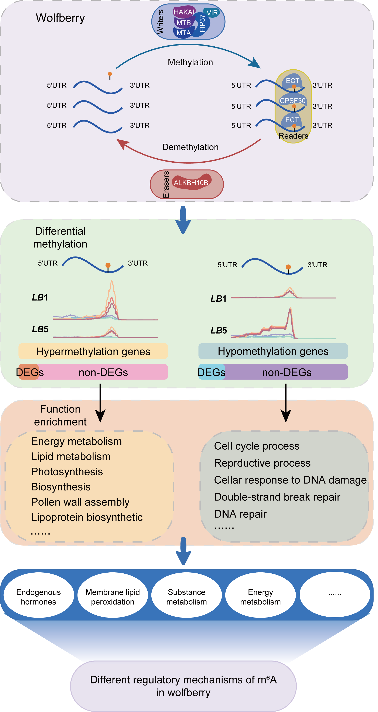

# Changes in m6A RNA methylation are associated with male sterility in wolfberry

## Abstract

- **Background:** *N*6-methyladenosine (m6A) modification is the most abundant type of RNA modification in eukaryotic cells, playing pivotal roles in multiple plant growth and development processes. Yet the potential role of m6A in conferring the trait of male sterility in plants remains unknown.

- **Results:** In this study, we performed RNA-sequencing (RNA-Seq) and m6A-sequencing (m6A-Seq) of RNAs obtained from the anther tissue of two wolfberry lines: ‘Ningqi No.1’ (*LB1*) and its natural male sterile mutant ‘Ningqi No.5’ (*LB5*). Based on the newly assembled transcriptome, we established transcriptome-wide m6A maps for *LB1* and *LB5* at the single nucleus pollen stage. We found that the gene *XLOC_021201*, a homolog of m6A eraser-related gene *ALKBH10* in *Arabidopsis thaliana*, was significantly differentially expressed between *LB1* and *LB5*. We also identified 1642 and 563 m6A-modified genes with hypermethylated and hypomethylated patterns, respectively, in *LB1* compared with *LB5*. We found the hypermethylated genes significantly enriched in biological processes related to energy metabolism and lipid metabolism, while hypomethylation genes were mainly linked to cell cycle process, gametophyte development, and reproductive process. Among these 2205 differentially m6A methylated genes, 13.74% (303 of 2205) were differentially expressed in *LB1* vis-à-vis *LB5*.

- **Conclusions:** This study constructs the first m6A transcriptome map of wolfberry and establishes an association between m6A and the trait of male sterility in wolfberry.

## How to cite
Zhao J, Zhang C, Li S, et al. Changes in m6A RNA methylation are associated with male sterility in wolfberry. *BMC Plant Biol*. 2023;23(1):456. Published 2023 Sep 29. doi:10.1186/s12870-023-04458-7
